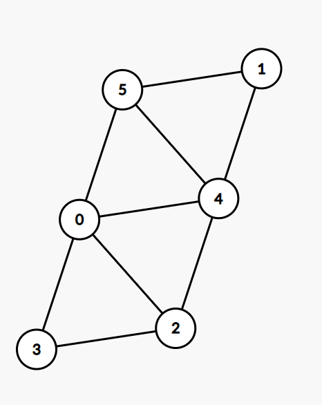

# Использование KoSAT

- Необходима зависимость на [KoSAT](https://github.com/UnitTestBot/kosat). Добавить в `build.gradle.kts`:

```
repositories {
    ...
    maven(url = "https://jitpack.io")
}

dependencies {
    ...
    implementation("com.github.UnitTestBot.kosat:kosat:98a4c90")
}
```

- Пример использования. Три условия:
  1. Невежливо ходить без футболки или без галстука, поэтому хотя бы что-то должно быть надето
  2. Странно ходить в галстуке без футболки
  3. Странно ходить и в галстуке, и в футболке одновременно

```kotlin
import org.kosat.Kosat

fun main() {
// Create the SAT solver:
val solver = Kosat(mutableListOf(), 0)

    // Allocate two variables:
    solver.addVariable()
    solver.addVariable()

    // Encode TIE-SHIRT problem:
    solver.addClause(-1, 2)
    solver.addClause(1, 2)
    solver.addClause(-1, -2)
    // solver.addClause(1, -2) // UNSAT with this clause

    // Solve the SAT problem:
    val result = solver.solve()
    println("result = $result")

    // Get the model:
    val model = solver.getModel()
    println("model = $model")
}
```

## Решаем задачу о раскраске графа

- Подумайте, как можно закодировать задачу о раскраске в терминах SAT-задачи.
- Теперь реализуйте ваше решение на Котлине с использованием библиотеки KoSAT.
- Проверьте решение на этом графе:


### Решаем задачу о расстановке ферзей

Попробуйте решить эту задачу с помощью KoSAT самостоятельно.